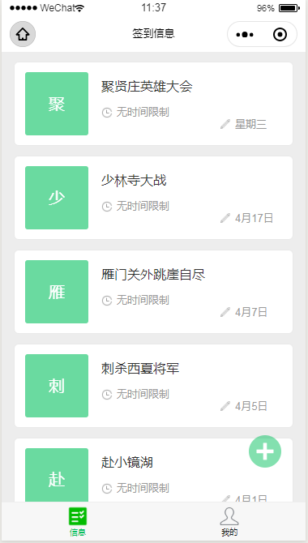

# 发起签到

当角色是 **签到发起人** 时，可以发起签到。如果当前用户角色是 签到人，需要[切换](jiao-se.md#qie-huan-jiao-se)角色。

## 发起签到

进入 信息 **页面**，点击屏幕右下角的 **+** 即可发起签到。

## 发起的签到信息

发起签到包含如下信息：

**签到主题**   
必填。  
签到的主题或标题。

**附加说明**  
选填。  
签到的详细描述，用于对签到主题的补充。

**附加签到信息**  
必填。  
用户签到时，除了收集姓名之外，往往还需要收集其他信息，如手机号、邮箱等等。发起人在发起签到时，可要求签到人输入最多4项附加签到信息。

**签到的时间范围**  
默认不设置。  
如果设置了签到的时间范围，那么只有在指定的时间范围内才允许签到。不设置时，用户在任何时间都可以签到。

**定时发送签到详情的邮件**  
默认不设置。  
设置一个时间，把用户的签到详情发送至预留的邮箱。

**指定签到地点**   
默认不设置。  
如果设置了签到地点，那么只有在签到地点**附近**，才允许签到。关于**附近**的定义，可以设置到签到地点的距离范围，可选范围在 120米 到 2520米 之间。  
注意：请**谨慎**设置签到的地理位置。如果必须设置地理位置，请尽量保证地理位置 准确，地图上的稍许差距，对应现实中距离可能会很大。错误的地理位置可能会导致大批用户无法签到。  
不设置时，任何人在任何地方都可以签到。

**允许重复签到**  
默认不设置。  
设置时，同一个人可以签到多次。如果不设置，则一个用户只允许签到一次。

**允许签到人修改自己的签到信息**  
默认不设置。  
设置后，签到人在签到后可以修改自己的签到信息，如姓名等。默认不允许修改。

